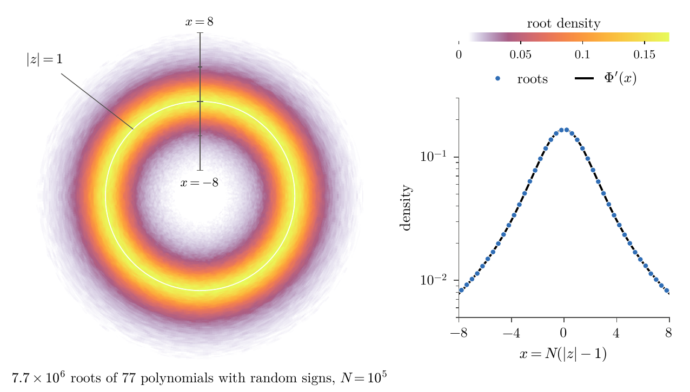
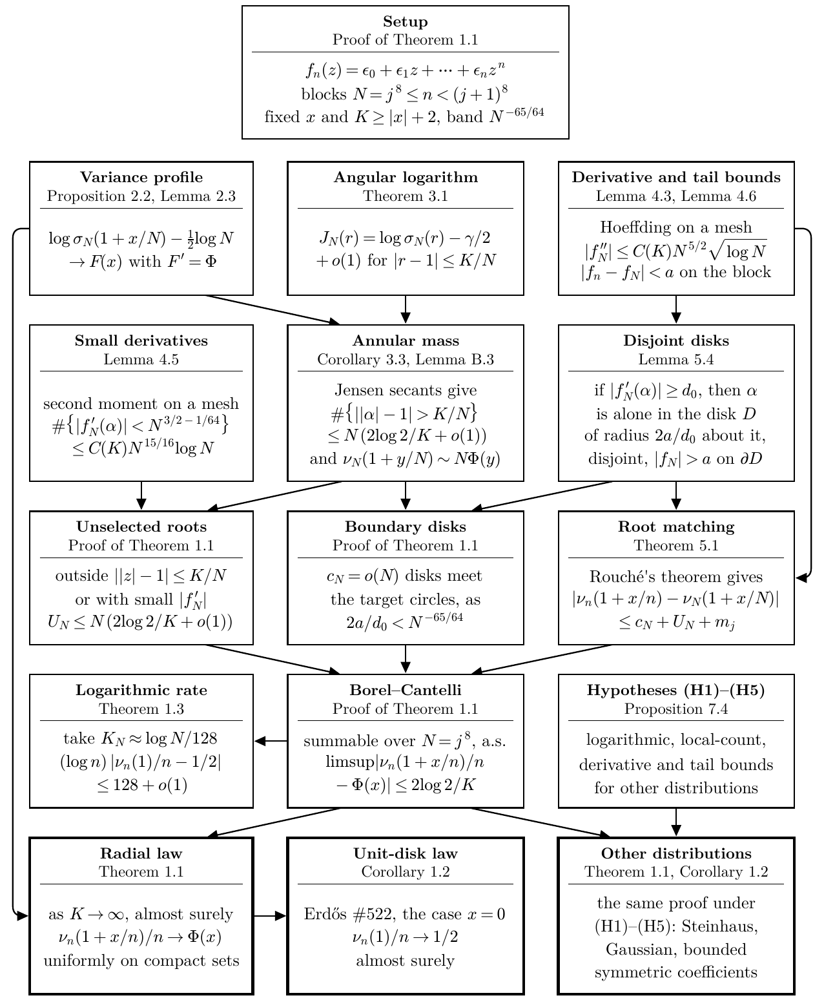
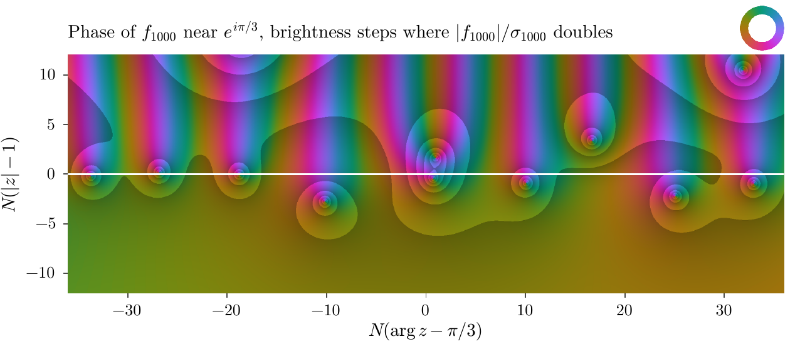
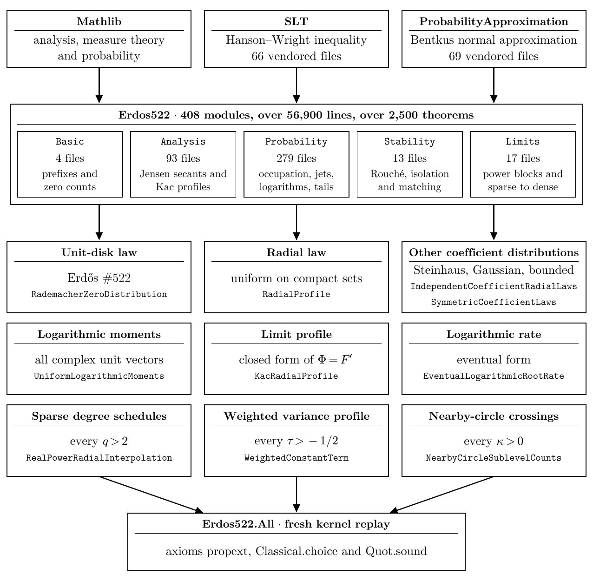

# Almost-Sure Radial Laws for Nested Random Polynomials and Erdős Problem #522

For one infinite sequence of random signs, the polynomials $f_n(z)=\varepsilon_0+\varepsilon_1z+\cdots+\varepsilon_nz^n$ almost surely have $n/2+o(n)$ zeros in the closed unit disk, which answers Erdős Problem #522, with the results below formalized in Lean 4.

[](https://github.com/chreia/erdos-522/actions/workflows/lean.yml) [](#license) [](lean/lean-toolchain) [](Erdos522.pdf)

Sebastien Kawada, MIT CSAIL. Version 1.1.0, September 2026.

## Main results

Let $\varepsilon_0,\varepsilon_1,\dots$ be independent signs, each $\pm1$ with probability $1/2$, and let $\nu_n(r)$ be the number of zeros of $f_n$ in the closed disk $|z|\le r$, counted with multiplicity. Erdős asked in 1961 whether $\nu_n(1)/n\to1/2$ almost surely. Yakir proved convergence in probability in 2021.

**Corollary 1.2 (Erdős Problem #522).** Almost surely,

```math
\lim_{n\to\infty}\frac{\nu_n(1)}{n}=\frac12 .
```

**Theorem 1.1 (radial law).** Almost surely, for every $A>0$,

```math
\lim_{n\to\infty}\ \sup_{|x|\le A}\ \left|\frac{\nu_n(1+x/n)}{n}-\Phi(x)\right|=0,
\qquad
\Phi(x)=\frac12\Bigl(1+\coth x-\frac1x\Bigr),\quad \Phi(0)=\frac12 .
```

The same laws hold for Steinhaus, standard real Gaussian, standard complex Gaussian and nondegenerate bounded centrally symmetric coefficients.

**Theorem 1.3 (rate).** For random signs, almost surely

```math
\limsup_{n\to\infty}\,(\log n)\left|\frac{\nu_n(1)}{n}-\frac12\right|\le 128 .
```

<p align="center"></p>

**Figure 1.** Density of the zeros of 77 random Littlewood polynomials of degree $10^5$ near the unit circle (left), and its angular average with the limiting density $\Phi'$ (right).

## Proof outline

The paper first proves the laws along the degrees $N=j^8$, where the Borel–Cantelli lemma applies, and then extends them to every degree $n$ between $j^8$ and $(j+1)^8$ with Rouché's theorem, after showing that few zeros near the unit circle have a small derivative.

<p align="center"></p>

**Figure 2.** Structure of the proof. Arrows point from inputs to the steps that use them.

<p align="center"></p>

**Figure 8.** Phase portrait of $f_{1000}$ near $e^{i\pi/3}$ for one sequence of signs. All hues meet at each zero. Near a zero with a large derivative the small level curves are nearly circles, like the boundaries of the disjoint disks about the selected roots in Lemma 5.4.

## Quick start

With [elan](https://github.com/leanprover/elan) installed:

```sh
git clone https://github.com/chreia/erdos-522.git
cd erdos-522/lean
lake exe cache get                         # download the compiled Mathlib
lake build                                 # compile the formalization
lake env lean checks/MainTheorems.lean     # print the 45 main theorems and check their axioms
lake env leanchecker --fresh Erdos522.All  # replay every proof in the Lean kernel
```

The axiom check fails unless every main theorem depends only on `propext`, `Classical.choice` and `Quot.sound`, so an unfinished proof (`sorry`) would make it fail. The kernel replay prints nothing when every proof is accepted.

<details>
<summary>The formal statement of Erdős #522</summary>

```lean
theorem erdos_522 :
    ∀ᵐ ω ∂rademacherSequenceMeasure,
      Tendsto (fun N : ℕ =>
        (closedZeroCount (polynomialPrefix (fun k => LogMoments.sign (ω k)) (fun _ => 1) N) 1 : ℝ) / N)
        atTop (𝓝 (1 / 2 : ℝ))
```

For almost every sequence of fair coin tosses $\omega$, the number of zeros of $\sum_{k=0}^N\pm z^k$ in the closed unit disk, divided by $N$, tends to $1/2$.

| Name | Meaning |
|---|---|
| [`rademacherSequenceMeasure`](lean/Erdos522/Probability/RademacherSequence.lean#L31) | the product of fair coins on `ℕ → Bool` |
| [`LogMoments.sign b`](lean/Erdos522/Probability/LogMoments/FiniteFourier.lean#L29) | $+1$ if `b` is `true` and $-1$ otherwise |
| [`polynomialPrefix ξ c N`](lean/Erdos522/Basic/PolynomialPrefixes.lean#L20) | the polynomial $\sum_{k=0}^N\xi_kc_kz^k$ |
| [`closedZeroCount P r`](lean/Erdos522/Basic/ZeroCount.lean#L22) | the number of roots of $P$ in the closed disk of radius $r$, with multiplicity |

</details>

<p align="center"></p>

**Modules of the formalization.** Mathlib and two vendored libraries supply the general theory. Each lower box names a result of the paper and the module of its declaration, and `Erdos522.All` imports every one of them for the kernel replay.

## Repository

| Path | Contents |
|---|---|
| [`Erdos522.pdf`](Erdos522.pdf) | the paper, 145 pages |
| [`paper/`](paper) | its LaTeX source, bibliography and figures |
| [`lean/`](lean) | the Lean formalization, with the declaration of each result in [`lean/README.md`](lean/README.md) and a comparison with the paper in [`lean/CORRESPONDENCE.md`](lean/CORRESPONDENCE.md) |
| [`lean/checks/MainTheorems.lean`](lean/checks/MainTheorems.lean) | the axiom check of the 45 main theorems |
| [`numerics/publication/`](numerics/publication) | scripts, seeds and summary data for the numerical figures and tables |
| [`CHANGELOG.md`](CHANGELOG.md), [`CITATION.cff`](CITATION.cff) | release notes and citation metadata |

## Citation

```bibtex
@misc{Kawada2026Erdos522,
  author = {Sebastien Kawada},
  title  = {Almost-Sure Radial Laws for Nested Random Polynomials and {Erd\H{o}s} Problem \#522},
  year   = {2026},
  month  = sep,
  note   = {Version 1.1.0, with a Lean formalization},
  doi    = {10.5281/zenodo.22970145},
  url    = {https://github.com/chreia/erdos-522}
}
```

## License

The paper (`Erdos522.pdf`, and [`paper/`](paper) except the scripts in [`paper/figures/explanatory/src/`](paper/figures/explanatory/src)) and the figure PDFs in [`numerics/publication/figures/`](numerics/publication/figures) are licensed under [CC BY 4.0](paper/LICENSE). Everything else, including the Lean formalization and all scripts, is licensed under the [Apache License 2.0](LICENSE). The vendored Lean libraries keep their own notices, listed in [NOTICE](NOTICE).

Correspondence: Sebastien Kawada, kawada@csail.mit.edu
